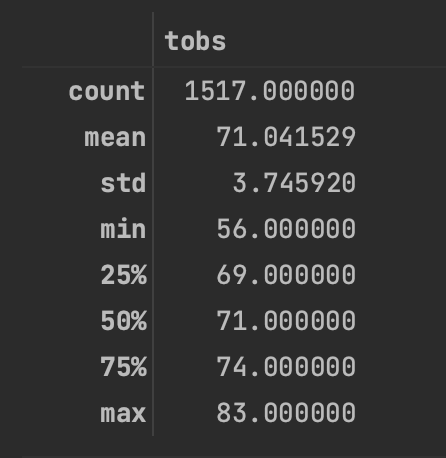

# Surf's Up Weather Analysis 

## Purpose 
Analysis of the key temperature differences in weather between June and December in our dataset. 

## Results 
- The minimum temperature in December is 56 which is 8 degrees colder than June which is 64. 
- The standard deviation is 3.25 degrees in June vs 3.74 in December. The temperature fluctuation in December have more variability.
- The average temperature is almost 4 degrees higher in June than in December 
- The temperature range is an additional 6 degrees in December than in June. 

### June Analysis 

### December Analysis 

## Summary 
- June has less temperature variations than December. 
- The average temperature is about 4 degrees higher in June than July. 
 
### Additional analysis
- It would be good to see the numbers of days for each temperature to better understand what a more "typical" day might be in each month.
- Looking at different years might  reveal some trends if a particular year had some weather events that other years did not have.
- Both datasets have outliers. It might be good to take these into considering when interpreting the data 
